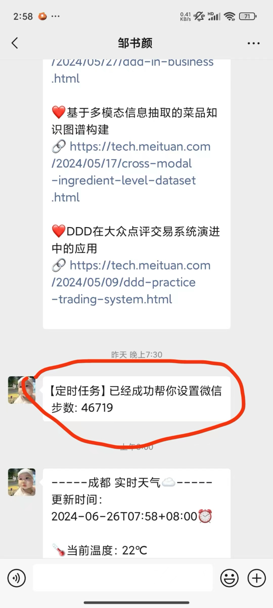
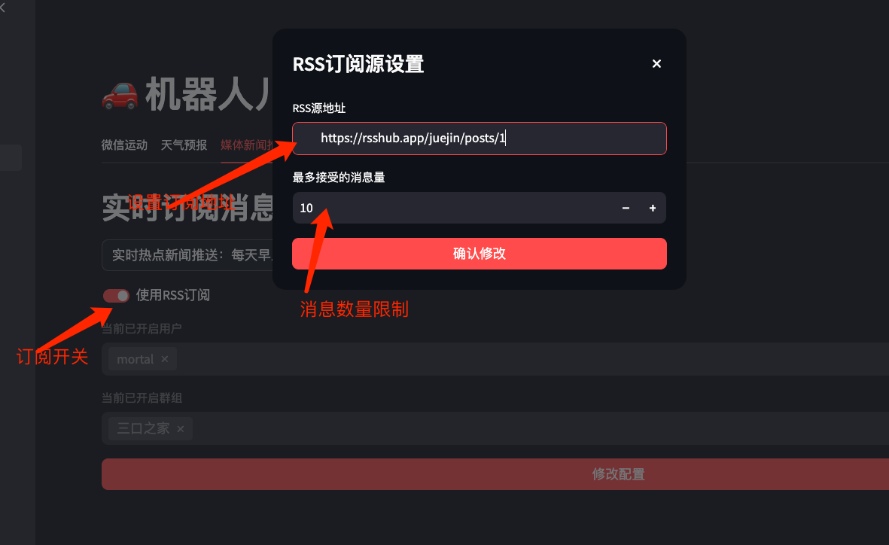

<p align="center">
  <a href="https://github.com/Geniusay/ChopperBot">
   
  </a>
</p>

<p align="center">
  <strong>微信机器人助手</strong>
</p>


<p align="center">
  <a href="https://github.com/code-innovator-zyx/wechat-gptbot/blob/main/README.md">
    
  </a>

  <a target="_blank" href='https://github.com/code-innovator-zyx/wechat-gptbot'>
        
   </a>

   <a target="_blank" href=''>
        
   </a>
</p>

<p align='center'>
  <b>English</b> | <a href="https://github.com/code-innovator-zyx/wechat-gptbot/blob/main/README.md">简体中文</a> 
</p>

# 给孩子或宠物创建一个 GPT 机器人

欢迎来到 **微信 GPT 机器人** 项目！这个项目可以帮助你在微信上创建一个智能机器人，用于与孩子或宠物互动。你可以利用它发送消息、查询天气、获取每日新闻等。

> 项目地址: [https://github.com/code-innovator-zyx/wechat-gptbot](https://github.com/code-innovator-zyx/wechat-gptbot)

最近我们家迎来了一个新的生命，这个机器人可以方便家人提前与她互动。这不仅有助于培养她的微信账号，还可以在以后将微信号交给她。☺️

## 项目优势

- **易于部署**：Golang 编译的二进制文件，避免了其他语言的依赖问题。
- **微信登录**
  ：使用桌面版微信协议，突破微信登录限制（感谢开源项目 [openwechat](https://github.com/eatmoreapple/openwechat)）。

## 功能列表

- **文本对话**：接收并回复私聊或群聊消息，基于 OpenAI 的 GPT-4-turbo 生成内容。
- **用户级上下文管理**：保证每个用户的对话按提问顺序生成上下文。
- **触发口令**：
    - 私聊时无需额外触发口令。
    - 群聊中需 @机器人或使用指定口令触发对话。
- **连续对话**：支持私聊和群聊的连续对话，默认记忆最近三组对话及最初提示词。
- **图片生成**：根据描述生成图片并回复。
- **称谓识别**：识别对话中的称谓，并在回复中附带对方称谓。
- **会话隔离**：不同用户的对话独立管理，保持 session 隔离。
- **图片压缩**：自动压缩生成的图片以便传输。
- **聊天模型配置**：可自定义聊天模型。
- **模型代理切换**：支持使用 OpenAI 的代理地址。
- **微信朋友圈插件**：控制微信计步器，修改微信运动步数（待集成）。
- **大模型交互界面**：基于纯后端的交互界面，支持更多功能。
- **插件管理**：自定义插件管理，可以随心所欲增加插件。
- **定时触发器**：通过自然语言设置定时触发器，代码小白也能设置定时任务。
- **实时天气查询插件**：随时查询全国各地的天气预报。
- **实时热点事件查询插件**：随时查询热点事件(支持RSS订阅)。
- **微信装逼神器插件**：每天自动帮我刷新微信运动步数，通过配置设置范围，能在朋友圈装逼

|  |  |
|----------------------|----------------------|

## 待实现功能

- **群聊和私信消息隔离**：实现不同用户的群聊和私信信息上下文隔离。
- **GPT-4 语音对话**：通过微信与 GPT-4 进行语音对话。
- **RSS 多订阅源支持**：支持订阅多个RSS源，推送
- **更多功能**：欢迎提供意见和建议。

## 最近更新

### 2024年 6月14日

- **新增功能**：自定义插件系统，目前支持天气预报和每日热点新闻。
- **插件调用**：无需特殊唤醒词，只需正常询问即可。

|  |  |
|--------------------|--------------------|

### 2024年 6月19日

- **自动消息推送**：每天早晨自动发送天气和热点消息。
- **定制化时间设置**：可在 `cron.json` 中修改触发时间。
- **自然语言时间设置**：可视化工具允许通过自然语言设置时间。
- **插件定制**：在 `core/plugins` 目录下添加自定义插件。

|  |  |
|-------------------------|-------------------------|

### 2024年 6月25日

- **媒体新闻订阅支持RSS**：支持设置RSS订阅源，推送查询订阅消息。



### 插件示例：添加一个新闻插件

以下是如何添加一个自定义的新闻插件：

```go
package news

import (
	"wechat-gptbot/core/plugins"
)

const NewsPluginName = "NewsPlugin"

type plugin struct {
}

func NewPlugin() plugins.PluginSvr {
	return &plugin{}
}

func (p plugin) Do(i ...interface{}) string {
	return "插件返回的结果"
}

func (p plugin) Name() string {
	return NewsPluginName
}

func (p plugin) Scenes() string {
	return "每日热点新闻"
}

func (p plugin) IsUseful() bool {
	return true
}

func (p plugin) Args() []interface{} {
	return nil
}
```

## UI 界面（选装）

如果需要 UI 界面展示，可以安装 Python 环境或使用 Docker 构建。所有环境已打包成基础镜像，见 Dockerfile。

### 优点

- 无需适配手机端，支持公网访问，手机可直接访问和修改配置。

|  |  |
|--------------------|--------------------------|

## 聊天效果预览

以下是一些聊天效果的展示，包括群聊对话、私聊对话和图片生成的例子：

|  |  |
|----------------------|--------------------|
|    |                    |
|    |                    |

## 开始部署

### 一、环境准备

- 一台服务器或长期开启的 PC。
- OpenAI 账号及生成的 `SECRET KEY`。
- 一个微信账号。

> 注：OpenAI 的域名 `https://api.openai.com` 在国内可能无法访问，需自行解决 API
> 访问问题。推荐使用国内代理如 [https://api.v3.cm/register?aff=5KuW](https://api.v3.cm/register?aff=5KuW)。

### 二、配置

1. 克隆代码到本地：

   ```shell
   git clone https://github.com/code-innovator-zyx/wechat-gptbot
   cd wechat-gptbot
   ```

2. 执行初始化：
    ```shell
    make init
   
    ```
   执行完成后你将看到三个文件

- `/config/config.json`：机器人的基础配置文件。
- `/config/prompt.conf`：OpenAI 模型的提示语文件。
- `/config/cron.json`: 定时执行插件计划

3. 根据你个人信息修改配置文件`config.json` 和 提示词文件`prompt.conf`：

- `proxy_url`：访问 OpenAPI 接口的代理地址。
- `auth_token`：OpenAI 官网生成的 `SECRET KEY`。
- `trigger_prefix`：微信对话中触发 AI 回复的前缀。
- `context_status`：开启上下文聊天功能。


4. 运行服务,你可以选择两种运行方式：

   ```shell
   # 1本地运行
   make local
   
   # 2 docker运行
   make docker
   ```

首次执行时，机器人会提示扫码登录微信。

- 登录完成后，系统会生成一个 `token.json` 文件，用于保存当前的微信登录状态，避免每次运行都需要