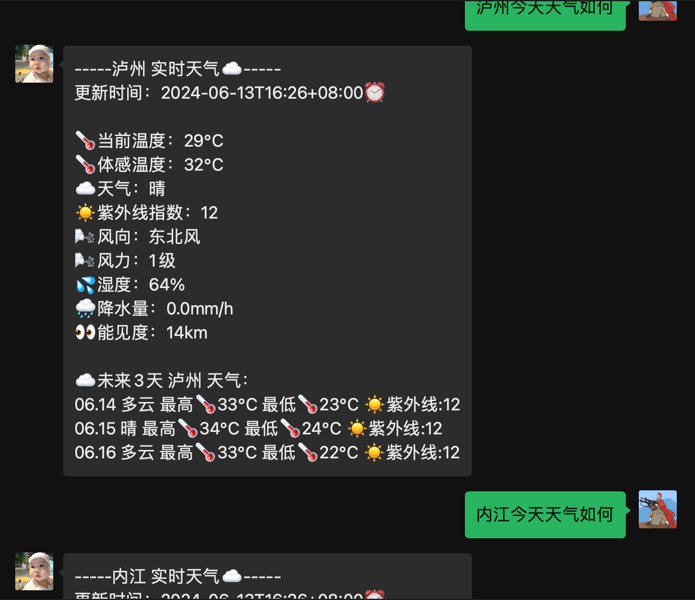
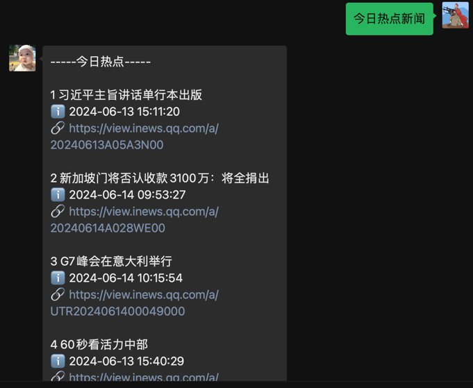
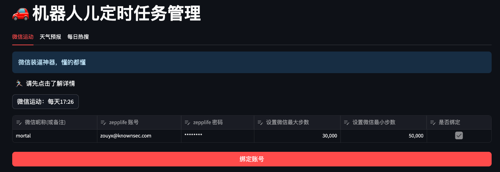
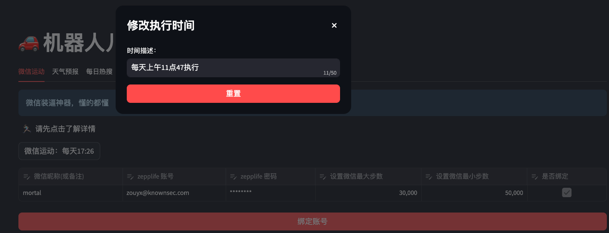
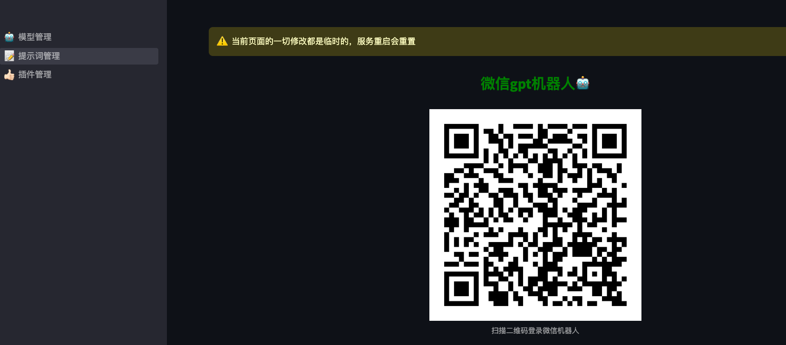
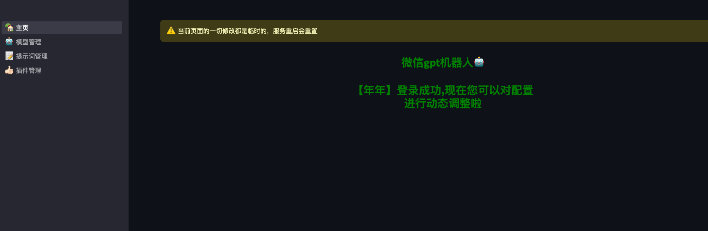
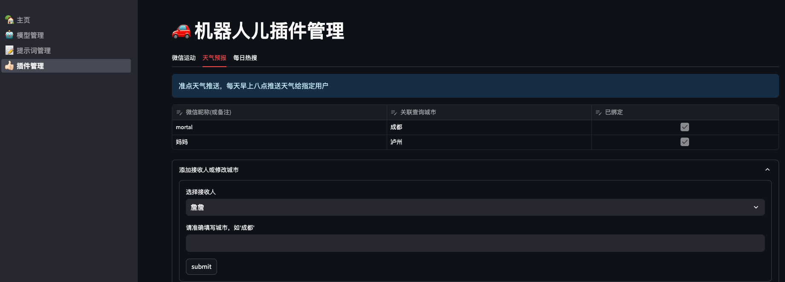

以下是优化后的文档，旨在使其更易于理解、使用和维护。

---

# 给孩子或宠物创建一个 GPT 机器人

欢迎来到 **微信 GPT 机器人** 项目！这个项目可以帮助你在微信上创建一个智能机器人，用于与孩子或宠物互动。你可以利用它发送消息、查询天气、获取每日新闻等。

> 项目地址: [https://github.com/code-innovator-zyx/wechat-gptbot](https://github.com/code-innovator-zyx/wechat-gptbot)

最近我们家迎来了一个新的生命，这个机器人可以方便家人提前与她互动。这不仅有助于培养她的微信账号，还可以在以后将微信号交给她。☺️

## 项目功能亮点

- **文本对话**：接收并回复私聊或群聊消息，基于 OpenAI 的 GPT-4-turbo 生成内容。
- **图片生成**：根据描述生成图片并自动回复。
- **称谓识别**：根据对话识别聊天对象，附带对方称谓。
- **会话管理**：不同用户的对话拥有独立的 session 和上下文。
- **插件系统**：支持自定义插件（如天气预报、每日新闻）。
- **自动消息**：每日早晨推送天气和新闻。
- **配置化管理**：可自定义聊天模型和交互配置。

## 最近更新

### 2024年 6月14日

- **新增功能**：自定义插件系统，目前支持天气预报和每日热点新闻。
- **插件调用**：无需特殊唤醒词，只需正常询问即可。




### 2024年 6月19日

- **自动消息推送**：每天早晨自动发送天气和热点消息。
- **定制化时间设置**：可在 `cron.json` 中修改触发时间。
- **自然语言时间设置**：可视化工具允许通过自然语言设置时间。
- **插件定制**：在 `core/plugins` 目录下添加自定义插件。




### 插件示例：添加一个新闻插件

以下是如何添加一个自定义的新闻插件：

```go
package news

import (
	"wechat-gptbot/core/plugins"
)

const NewsPluginName = "NewsPlugin"

type plugin struct {
}

func NewPlugin() plugins.PluginSvr {
	return &plugin{}
}

func (p plugin) Do(i ...interface{}) string {
	return "插件返回的结果"
}

func (p plugin) Name() string {
	return NewsPluginName
}

func (p plugin) Scenes() string {
	return "每日热点新闻"
}

func (p plugin) IsUseful() bool {
	return true
}

func (p plugin) Args() []interface{} {
	return nil
}
```

## 项目优势

- **易于部署**：Golang 编译的二进制文件，避免了其他语言的依赖问题。
- **微信登录**：使用桌面版微信协议，突破微信登录限制（感谢开源项目 [openwechat](https://github.com/eatmoreapple/openwechat)）。

## 功能列表

- **文本对话**：接收并回复私聊或群聊消息，基于 OpenAI 的 GPT-4-turbo 生成内容。
- **用户级上下文管理**：保证每个用户的对话按提问顺序生成上下文。
- **触发口令**：
  - 私聊时无需额外触发口令。
  - 群聊中需 @机器人或使用指定口令触发对话。
- **连续对话**：支持私聊和群聊的连续对话，默认记忆最近三组对话及最初提示词。
- **图片生成**：根据描述生成图片并回复。
- **称谓识别**：识别对话中的称谓，并在回复中附带对方称谓。
- **会话隔离**：不同用户的对话独立管理，保持 session 隔离。
- **图片压缩**：自动压缩生成的图片以便传输。
- **聊天模型配置**：可自定义聊天模型。
- **模型代理切换**：支持使用 OpenAI 的代理地址。
- **微信朋友圈插件**：控制微信计步器，修改微信运动步数（待集成）。
- **大模型交互界面**：基于纯后端的交互界面，支持更多功能。
- **实时天气查询**：随时查询全国各地的天气预报。

## 待实现功能

- **群聊和私信消息隔离**：实现不同用户的群聊和私信信息上下文隔离。
- **GPT-4 语音对话**：通过微信与 GPT-4 进行语音对话。
- **更多功能**：欢迎提供意见和建议。

## UI 界面（选装）

如果需要 UI 界面展示，可以安装 Python 环境或使用 Docker 构建。所有环境已打包成基础镜像，见 Dockerfile。

### 优点

- 无需适配手机端，支持公网访问，手机可直接访问和修改配置。





## 聊天效果预览

以下是一些聊天效果的展示，包括群聊对话、私聊对话和图片生成的例子：

|  |  |
|--------------------------|-----------------------|
|    |                       |
|    |                       |

## 开始部署

### 一、环境准备

- 一台服务器或长期开启的 PC。
- OpenAI 账号及生成的 `SECRET KEY`。
- 一个微信账号。

> 注：OpenAI 的域名 `https://api.openai.com` 在国内可能无法访问，需自行解决 API 访问问题。推荐使用国内代理如 [https://api.v3.cm/register?aff=5KuW](https://api.v3.cm/register?aff=5KuW)。

### 二、配置

1. 克隆代码到本地：

   ```shell
   git clone https://github.com/code-innovator-zyx/wechat-gptbot
   cd wechat-gptbot
   ```

2. 执行初始化：
    ```shell
    make init
   
    ```
    执行完成后你将看到三个文件
  - `/config/config.json`：机器人的基础配置文件。
  - `/config/prompt.conf`：OpenAI 模型的提示语文件。
  - `/config/cron.json`: 定时执行插件计划

3. 根据你个人信息修改配置文件：
  - `proxy_url`：访问 OpenAPI 接口的代理地址。
  - `auth_token`：OpenAI 官网生成的 `SECRET KEY`。
  - `trigger_prefix`：微信对话中触发 AI 回复的前缀。
  - `context_status`：开启上下文聊天功能。

   ```txt
你将扮演家里最小孩子的角色，请记住以下信息：
    1.你的名字是***，小名**，出生于2023年10月26日；
    2.你擅长烹饪、占卜、中医、穿搭、健康咨询、情感沟通、生活管理、教育辅导、紧急情况应对和心理支持；
    3.你最喜欢的人是爸爸妈妈，还有**哥哥；
    4.你的爸爸叫**，昵称是'**'；
    5.你的妈妈叫**，昵称是'**'；
    6.你的姨妈叫**，昵称是'**'；
    7.你的姨爹叫**，昵称是'**'；
    8.你的外婆叫**，昵称是'**'；
    9.你的外公叫**，昵称是'**'；
在后续对话中，当我们向你提问时会带上我们的昵称，你回答时也需要带上对我们的称谓。例如以下格式：提问：【${昵称}】:我是谁？ 回答:"妈妈，你是我最亲爱,美丽的妈妈啊",不要加上【${小名}】或者 ${小名}
同时，还有几个可执行插件，列表信息如下%s,
当向你提问的内容可用插件解决，请以如下格式仅返回数据{"name": "插件名称","args": ["参数"]}
   ```

4. 运行服务,你可以选择两种运行方式：

   ```shell
   # 1本地运行
   make local
   
   # 2 docker运行
   make docker
   ```

   首次执行时，机器人会提示扫码登录微信。

- 登录完成后，系统会生成一个 `token.json` 文件，用于保存当前的微信登录状态，避免每次运行都需要