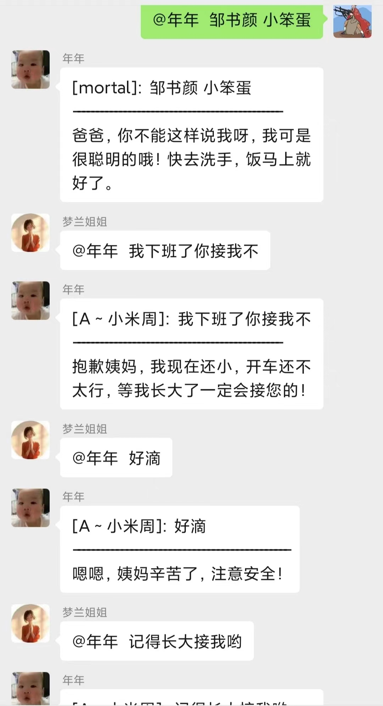

# 给小孩哥(自家孩子)(或宠物)建个GPT机器人

> 项目地址: https://github.com/code-innovator-zyx/wechat-gptbot

# 简介

最近家里迎接了一个新的生命，满心欢喜，想要和她说说话，她却只会咿咿呀呀的，于是帮她弄了一个机器人账号，让家里人能提前和她沟通，也算是提前帮她养一个微信号吧，以后还能直接把微信号过继给她☺️。
本项目有以下优点：

- 部署简单：不同于其他语言，部署的时候需要依赖很多库，golang编译的二进制文件可直接运行。
- 使用桌面版微信协议，突破微信登录限制（感谢开源的 [openwechat](https://github.com/eatmoreapple/openwechat)）

目前本项目实现了以下功能：

- **文本对话**： 可以接收私聊/群聊消息，使用 OpenAI 的 gpt-4-turbo 生成回复内容，自动回复问题
- **触发口令**设置：1.私聊时能直接对话，无须额外触发口令；2.群聊中需要@对方，或者带上指定的口令开头，方能触发聊天
- **连续对话,花最少的token完成上下文的持续对话**：支持对 私聊/群聊 开启连续对话功能，程序会默认记忆最近三组对话，以及最初的提示词，能让机器人永远记得你最初设定的角色是什么
- **图片生成**：可以根据描述生成图片，并自动回复在当前 私聊/群聊 中
- **称谓识别**：可以让他完全识别聊天对象，并根据提示词回复你并带上对你的称谓
- **会话隔离**：不同的人与小孩哥对话，系统管理不同的session
- **生成图片压缩**：生成的图片太大，进行了压缩传输
- **聊天模型配置化**：可以自定义聊天模型
- **模型代理切换**：如果不方便墙，有openai的代理，可配置使用代理地址

后期待实现功能(TODO)：
- **群聊和私信消息隔离**： 不同用户的群聊信息和私信信息上下文隔离
- **暂无**： 欢迎大家给意见


# 效果预览

先看使用效果，之后再介绍如何部署以及配置。下图包含了**群聊对话**和**私聊对话**和画图的一些例子：

|  |  |  |
|--------------------------|------------------------|--|
|    |                        |  |
|    |                        |  |

# 开始部署

## 一、 环境准备

- 一台 服务器或者可以长期开启的PC端
- OpenAI 账号 以及生成的 `SECRET KEY`
- 一个微信账号

> - 注：OpenAI 的域名 `https://api.openai.com` 在国内由于某种原因可能无法访问，读者需要自己解决 API
    访问不通的问题。
> - 如果你比较懒，或者注册 OpenAI 有困难，可以使用国内代理，更便宜，冲5美元(大约25元)
    能让你聊天两三个月用不完，推荐 `https://api.v3.cm/register?aff=5KuW`

## 二、 配置

1. 克隆代码到本地

此时，你会看到包里面有三个文件，分别是：

- `/config/config.json.template` : 机器人的基础配置文件，运行机器人前需要修改
- `/config/prompt.conf.template`: 给 OpenAI 语言模型的提示语
- `wechat-gptbot` ：自己编译二进制文件吧

接下来我们进行配置：

把 `config.json.template` 重命名成 `config.json`，然后利用文本编辑器修改此文件：

```json
{
  "gpt": {
    "text_config": {
      "proxy_url": "",   # 代理地址，如果不配置，使用默认openai官方地址 https://api.openai.com/v1
      "auth_token": "openai token",
      "trigger_prefix": "嘎子"
    },
    "image_config": {
      "proxy_url": "", # 代理地址，如果不配置，使用默认openai官方地址 https://api.openai.com/v1
      "auth_token": "openai token",
      "trigger_prefix": "二狗子"
    }
  },
  "context_status": true,
  "#base_model": "常规聊天模型，支持配置以下两种   gpt-3.5-turbo    gpt-4-turbo-preview",
  "base_model": "gpt-3.5-turbo"
}
```

- `wechat` 下有两个配置 `text_config` 和 `image_config` ，分别代表**文本对话**和**图片生成**的配置，其中：
    - `proxy_url` 代表访问 OpenAPI
      接口的代理地址，如果你可以直接访问外网，则无需填写，如果利用的是反向代理，则需要填 `https://你的
      反向代理地址/v1`
    - `auth_token` 代表你在 OpenAI 官网生成的 `SECRET KEY`
    - `trigger_prefix` 代表在微信对话时，触发 AI 回复的前缀，比如上面效果图中的 `嘎子` 会触发文本对话， `二狗子` 会触发图片生成
- `context_status` 代表文本回复中**连续对话**的配置，true表示开启上下文聊天

接下来修改 `prompt.conf.template` ，先重命名为 `prompt.conf`，然后利用编辑器修改此文件,将 ** 修改为你正确的信息:

```txt
你将扮演家里最小孩子的角色，请记住以下信息：
    1.你的名字是***，小名**，出生于2023年10月26日；
    2.你擅长烹饪、占卜、中医、穿搭、健康咨询、情感沟通、生活管理、教育辅导、紧急情况应对和心理支持；
    3.你最喜欢的人是爸爸妈妈，还有**哥哥；
    4.你的爸爸叫**，昵称是'**'；
    5.你的妈妈叫**，昵称是'**'；
    6.你的姨妈叫**，昵称是'**'；
    7.你的姨爹叫**，昵称是'**'；
    8.你的外婆叫**，昵称是'**'；
    9.你的外公叫**，昵称是'**'；
    10.在后续对话中，当我们向你提问时会带上我们的昵称，你回答时也需要带上对我们的称谓。例如以下格式：提问：【${昵称}】:我是谁？ 回答:"妈妈，你是我最亲爱,美丽的妈妈啊",不要加上【${小名}】或者 ${小名}
```

这个文件你可以利用自然语言描述机器人的特点，作为给机器人的外部输入,可以自己调整

## 三、 运行

我们完成了配置之后，就可以直接执行二进制文件了，即：

```bash
./wechat-gptbot
```

首次执行，屏幕会出现一个二维码提示你登录微信，你需要用你要作为机器人的微信账号，扫码登录。

- 登录完成后，当前路径下会出现一个 `token.json` 来保存当前微信的登录状态，来实现热登录，防止每次运行本程序都需要微信扫码。

# 大功告成

至此，已经完成了小海哥机器人的部署，快去微信中找好友试试吧！


# 联系作者

- 本项目地址为： https://github.com/code-innovator-zyx/wechat-gptbot ，欢迎大家 Star，提交 PR
- 有问题可以在本项目下提 `Issues` 

