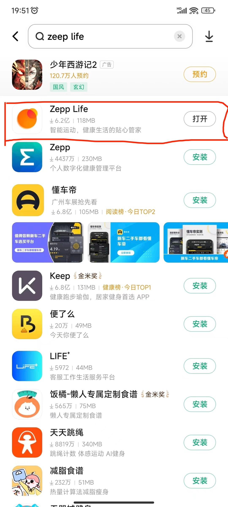
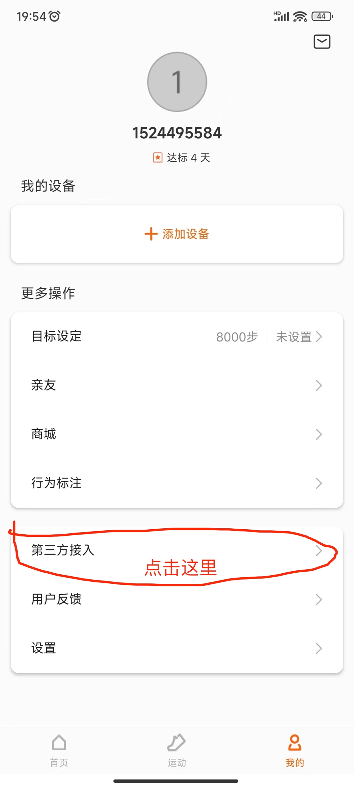
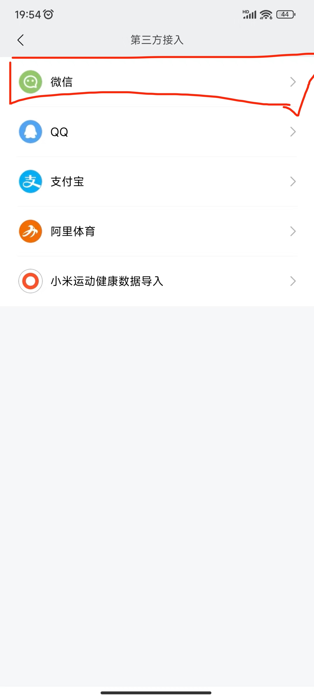

# 微信运动步数作弊

## 前言
为了在微信运动步数上霸榜，为了朋友圈装B，为了做公益捐步数

## 原理
本质上是利用`Zepp life`对外暴露的接口漏洞，通过脚本将步数刷到第三方App服务器，再由第三方App同步到微信运动实现
<br>


## 刷步步骤
1.下载 `Zepp life` App

2.用手机号或者邮箱号注册账号


3.绑定 `Zepp life` 账号到微信运动




4.通过脚本更新步数到`Zepp life`服务端，步数会自动同步到微信运动
确认你已经安装golang环境，clone本项目代码，在cmd目录下执行
```go build```
然后执行
```./cheater -user {你的zepplife账号} -password {你的zepp life密码} -step {你想刷的步数}```
刷步数。
(如成功无法刷步数，建议重新注册一个新账号并重新绑定)

## 注意⚠️
- 脚本一天内可多次执行，但是每次更新步数服务端会做check，只能比上次更新的更多，不能更少，更少则默认无效。
- 短时间不要多次执行脚本，会触发服务端限流，表现在第一个http请求会返回429响应。

